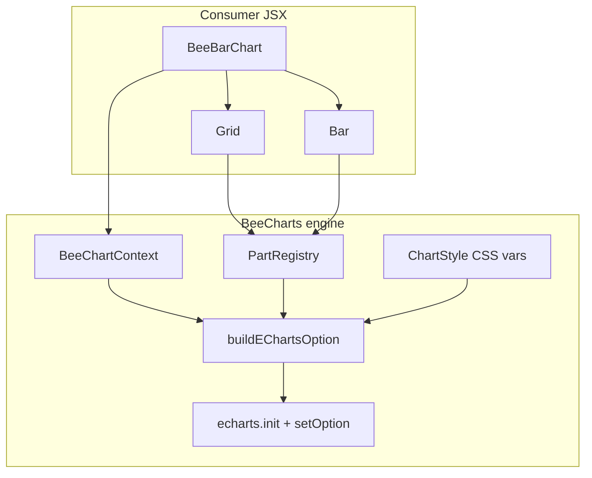

# BeeCharts — BeeCharts → ECharts migration plan

> **Superseded for day-to-day work.** Use [docs/index.md](./docs/index.md), [plans/README.md](./plans/README.md), and root [AGENTS.md](./AGENTS.md) instead. This file is kept as historical migration context.

## Goal

Create a new repo at [`/Users/bnguyen/Desktop/Github/beecharts`](/Users/bnguyen/Desktop/Github/beecharts) with a standalone markdown plan you can open in a **separate workspace**, then execute by **copying** [beecharts](/Users/bnguyen/Desktop/Github/beecharts) and systematically **replacing Recharts with ECharts** while preserving:

- **Compound public API** (`<BeeBarChart><Grid /><Bar /></BeeBarChart>` — namespaced rename from `Bee*` to `Bee*` or keep `Bee*` initially; recommend `Bee*` for brand clarity)
- **`ChartConfig` + CSS design tokens** ([`src/registry/ui/chart.tsx`](/Users/bnguyen/Desktop/Github/beecharts/src/registry/ui/chart.tsx) `--color-{key}-{i}` on `[data-chart]`)
- **`chart-recipes`** ([`src/registry/lib/chart-recipes.ts`](/Users/bnguyen/Desktop/Github/beecharts/src/registry/lib/chart-recipes.ts))
- **Registry / shadcn CLI** pattern ([`components.json`](/Users/bnguyen/Desktop/Github/beecharts/components.json), [`src/registry/index.ts`](/Users/bnguyen/Desktop/Github/beecharts/src/registry/index.ts))
- **Docs + agent skills** (`.agents/skills/beecharts/` → `beecharts/`)

**v1 chart scope (your choice):** bar, line, composed, pie, heatmap, gauge — defer radial full, radar, scatter, sankey, treemap, waterfall, funnel, sparkline to v2.

---

## Phase 0 — Bootstrap folder and plan file (first action in new workspace)

```bash
mkdir -p /Users/bnguyen/Desktop/Github/beecharts
```

Copy this plan into:

**`/Users/bnguyen/Desktop/Github/beecharts/PLAN.md`**

Also add minimal repo skeleton:

- `README.md` — one paragraph: BeeCharts = BeeCharts UX on ECharts
- `.gitignore` — copy from beecharts
- `LICENSE` — match beecharts if forked

Do **not** copy `node_modules` or `.next` when cloning.

---

## Phase 1 — Fork beecharts → beecharts

```bash
cd /Users/bnguyen/Desktop/Github
rsync -a --exclude node_modules --exclude .next --exclude .git \
  beecharts/ beecharts/
cd beecharts && git init
```

### Global rename checklist

| Area | From | To |
|------|------|-----|
| package name | `beecharts` | `beecharts` |
| Registry namespace | `@beecharts/*` | `@beecharts/*` (or `@beecharts/*`) |
| Site / homepage | `beecharts.com` | TBD local dev URL |
| Component prefix | `Bee*` | `Bee*` (recommended) |
| Paths | `components/beecharts/` | `components/beecharts/` |
| Skills | `.agents/skills/beecharts*` | `.agents/skills/beecharts*` |
| Logo/assets | `beechart` | `beechart` (optional v1) |

Files to touch in bulk:

- [`package.json`](/Users/bnguyen/Desktop/Github/beecharts/package.json) — remove `recharts`, add `echarts` + `echarts-for-react` (or thin `useECharts` hook)
- [`components.json`](/Users/bnguyen/Desktop/Github/beecharts/components.json) — `registries.@beecharts`
- [`src/registry/registry-chart.ts`](/Users/bnguyen/Desktop/Github/beecharts/src/registry/registry-chart.ts) — descriptions, deps `echarts` not `recharts`
- [`src/scripts/build-registry.mts`](/Users/bnguyen/Desktop/Github/beecharts/src/scripts/build-registry.mts) — unchanged flow
- All MDX/docs/skills string replacements

**Keep unchanged initially:** `src/content/docs/**` structure, example file names (`ex-bar-chart`), `chart-recipes.ts` logic.

---

## Phase 2 — Core architecture (compound API on ECharts)

Recharts maps 1:1 to React children; ECharts uses a single `option` object. **Compound parity** requires a **collector + compiler** inside each chart root.



### New shared modules (create under `src/registry/echarts-core/`)

| Module | Responsibility |
|--------|----------------|
| `bee-chart-context.tsx` | Generic context: `config`, `data`, `chartId`, `isLoading`, registered parts |
| `use-bee-echarts.ts` | ResizeObserver, init/dispose, `setOption` on option/theme/data change |
| `resolve-chart-colors.ts` | Read `ChartConfig` + computed CSS vars → palette hex for Canvas |
| `compile-bar.ts` / `compile-line.ts` / … | Per-chart compilers merging parts into `EChartsOption` |
| `parts/types.ts` | Discriminated union: `xAxis`, `yAxis`, `grid`, `barSeries`, `lineSeries`, `pieSeries`, `heatmap`, `gauge` |

### Adapt [`src/registry/ui/chart.tsx`](/Users/bnguyen/Desktop/Github/beecharts/src/registry/ui/chart.tsx)

- **Keep:** `ChartConfig`, `ChartStyle`, `validateChartConfigColors`, `LoadingIndicator`, `getLoadingData`
- **Replace:** `RechartsPrimitive.ResponsiveContainer` → div ref + `min-h-0 flex-1` for ECharts mount point
- **Remove:** Recharts-specific Tailwind selectors in `ChartContainer` className (replace with ECharts container rules as needed)
- **Add:** `onThemeChange` hook — re-resolve colors when `.dark` toggles and call `chart.setOption(..., { notMerge: false })`

### Compound children pattern (bar example)

Each subcomponent **registers** config on mount instead of rendering Recharts primitives:

```tsx
// BeeBarChart — simplified
function BeeBarChart({ config, data, children, ...rootProps }) {
  const parts = usePartRegistry();
  return (
    <BeeChartProvider config={config} data={data} parts={parts}>
      <ChartContainer config={config}>
        <EChartsHost option={compileBarOption(parts, rootProps)} />
        {children /* Grid, XAxis, Bar register via useRegisterPart */}
      </ChartContainer>
    </BeeChartProvider>
  );
}

function Bar({ dataKey, variant, ... }) {
  useRegisterPart({ type: 'bar', dataKey, variant, ... });
  return null; // or fragment
}
```

**v1 simplification:** motion grow-in, `BeeBrush`, and complex custom `shape` paths can be **stubs** (document as v2) if they block MVP; keep props on components for API compatibility but no-op where ECharts differs.

---

## Phase 3 — v1 chart port order

### 3.1 Bar — [`src/registry/charts/bar-chart.tsx`](/Users/bnguyen/Desktop/Github/beecharts/src/registry/charts/bar-chart.tsx)

- Compiler: `series: [{ type: 'bar', ... }]`, `xAxis`, `yAxis`, `grid`
- Map `layout` horizontal ↔ `xAxis/yAxis` category vs value
- Map `stackType` → `stack` on series
- Variants: `default` solid fill from `--color-*`; hatched/gradient v2 via `itemStyle` patterns
- Reuse examples: `ex-bar-chart`, `ex-stacked-type-bar-chart`, `ex-horizontal-layout-bar-chart`, `ex-bullet-chart`

### 3.2 Line — [`line-chart.tsx`](/Users/bnguyen/Desktop/Github/beecharts/src/registry/charts/line-chart.tsx)

- `series: [{ type: 'line' }]`, `smooth` / `step` from `curveType`
- `showBrush` v2 → `dataZoom` component registration

### 3.3 Composed — [`composed-chart.tsx`](/Users/bnguyen/Desktop/Github/beecharts/src/registry/charts/composed-chart.tsx)

- Multiple registered `bar` + `line` parts → mixed series array
- Pareto: dual `yAxis` + bar/line series (`ex-pareto-chart`)

### 3.4 Pie — [`pie-chart.tsx`](/Users/bnguyen/Desktop/Github/beecharts/src/registry/charts/pie-chart.tsx)

- `series: [{ type: 'pie', radius, data }]`
- Donut via `innerRadius` props on `<Pie />`

### 3.5 Heatmap — new first-class compiler (upgrade from scatter recipe)

- Native `series: [{ type: 'heatmap' }]`
- Replace / sideline [`ex-heatmap-chart.tsx`](/Users/bnguyen/Desktop/Github/beecharts/src/registry/examples/ex-heatmap-chart.tsx) scatter-cell hack with ECharts heatmap
- Add `heatmap-chart` to [`registry-chart.ts`](/Users/bnguyen/Desktop/Github/beecharts/src/registry/registry-chart.ts) OR keep as recipe-only on `BeeScatterChart` — **recommend dedicated `BeeHeatmapChart` in v1** since you selected heatmap for MVP

### 3.6 Gauge — [`radial-chart.tsx`](/Users/bnguyen/Desktop/Github/beecharts/src/registry/charts/radial-chart.tsx) semi variant

- ECharts `series: [{ type: 'gauge' }]`
- **Critical:** map `nameKey` + `chartConfig` keys correctly (lesson from gauge fix: `series` field must match config keys)
- `ex-gauge-chart`, `ex-gauge-with-target-chart` — target as second gauge pointer or `markLine`

---

## Phase 4 — Registry, docs, skills

| Task | Files |
|------|--------|
| Registry items | [`registry-chart.ts`](/Users/bnguyen/Desktop/Github/beecharts/src/registry/registry-chart.ts), [`registry-example.ts`](/Users/bnguyen/Desktop/Github/beecharts/src/registry/registry-example.ts), [`registry-lib.ts`](/Users/bnguyen/Desktop/Github/beecharts/src/registry/registry-lib.ts) |
| Build | `bun run registry:fresh` |
| Docs | Rename references in `src/content/docs/**`; add note on ECharts engine |
| Heatmap doc | New `heatmap-chart/static.mdx` or section under scatter → **dedicated page for MVP** |
| Skills | Fork [`.agents/skills/beecharts/`](/Users/bnguyen/Desktop/Github/beecharts/.agents/skills/beecharts) → `beecharts/` — update install (`echarts` peers), components (register/compile model), recipes |
| LLM index | [`src/lib/llm.ts`](/Users/bnguyen/Desktop/Github/beecharts/src/lib/llm.ts) |

---

## Phase 5 — Verification

- `bun run dev` — docs previews for v1 six charts render with colors in light/dark
- Typecheck: `tsc --noEmit`
- Spot-check: `ChartConfig` keys drive series colors after theme toggle
- CLI smoke: `npx shadcn add @beecharts/bar-chart` against local `public/r/*.json`

---

## Phase 6 — Explicitly out of scope for v1

- True 3D / isometric blocks (port later or drop)
- sankey, waterfall, funnel, sparkline, treemap, radar, scatter, radial-full
- Full variant parity (hatched, glowing, animated-dashed) — stub props, implement in v2
- `BeeBrush` / `dataZoom` parity
- Published npm — local registry only until stable

---

## Risk summary

| Risk | Mitigation |
|------|------------|
| Compound-on-ECharts is complex | Part registry + per-chart compiler; children return null |
| Canvas vs CSS vars | `resolve-chart-colors.ts` reads computed styles on theme change |
| API drift from BeeCharts | Keep same child component names/props; document no-ops |
| Large fork maintenance | Shared `chart-recipes` unchanged; only compilers differ |

---

## Execution order (checklist for PLAN.md)

1. Create `beecharts/` + `PLAN.md`
2. `rsync` beecharts → beecharts, `git init`
3. Rename packages/registry/branding
4. Add `echarts-core` + swap `ChartContainer`
5. Implement bar compiler + verify `ex-bar-chart`
6. Line → composed → pie → heatmap → gauge
7. Registry build + docs + skills
8. Defer v2 charts and visual variants
