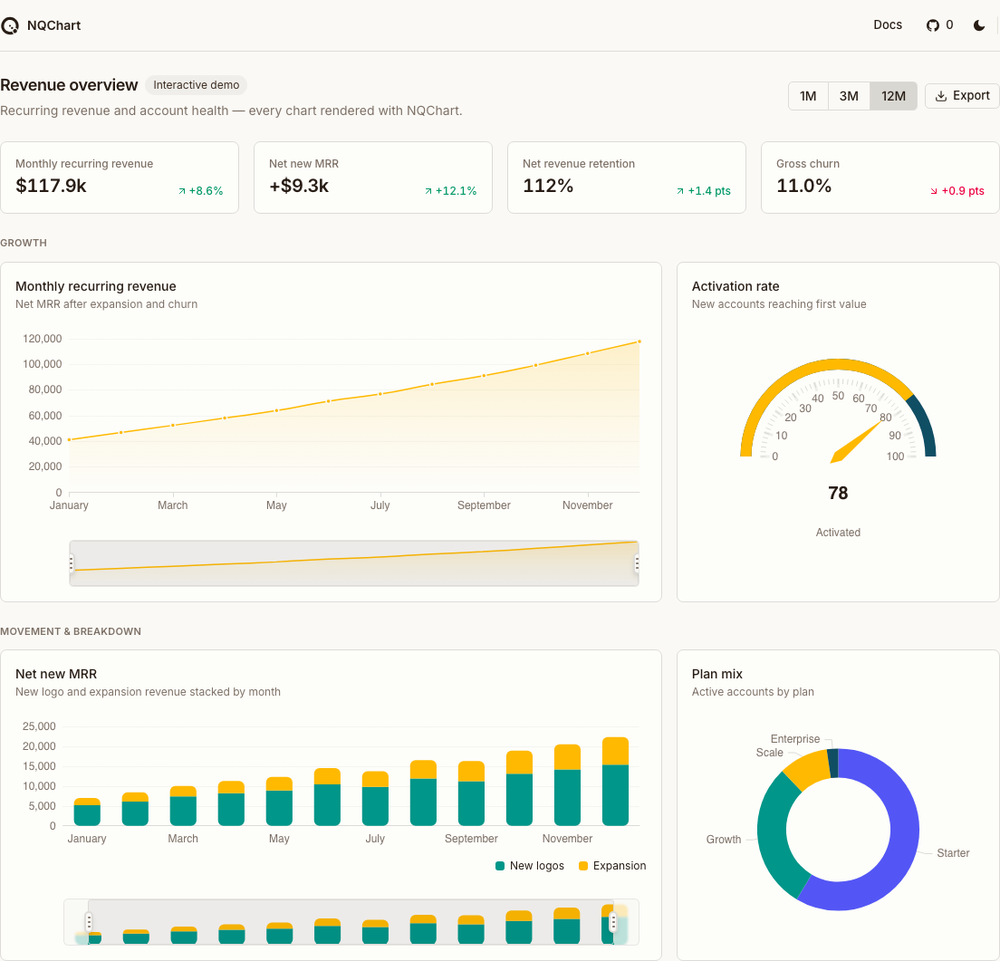
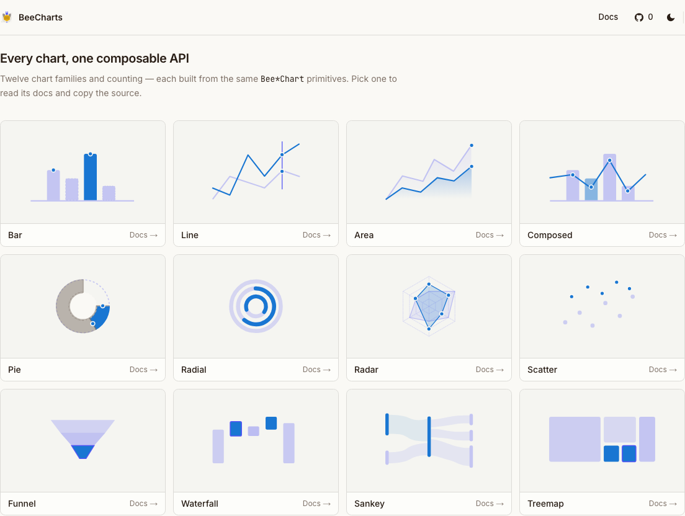
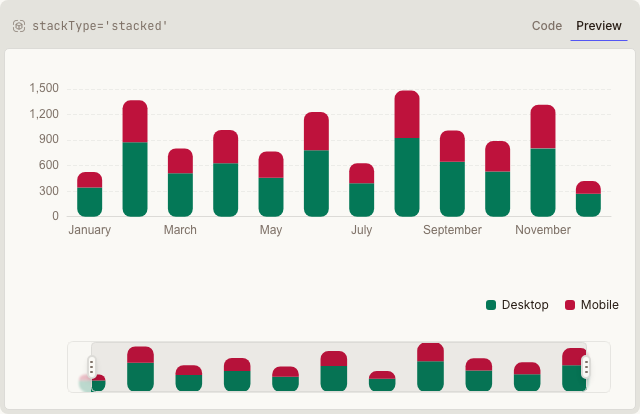
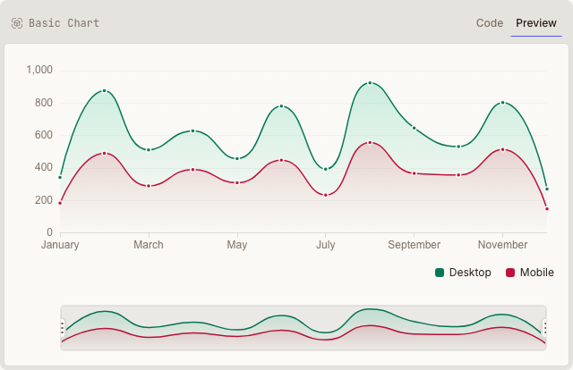
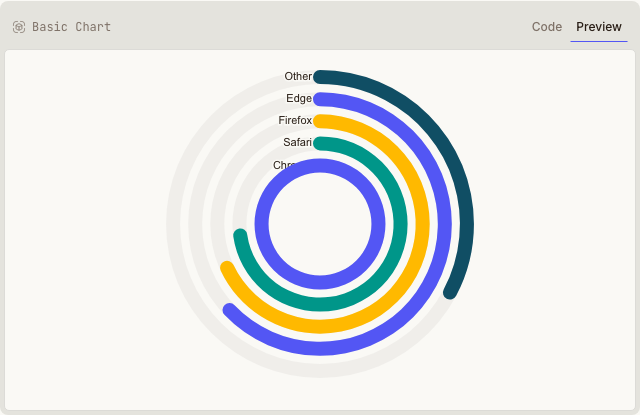
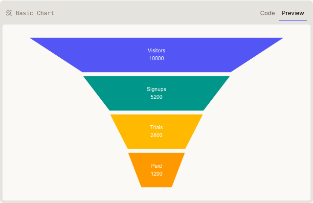
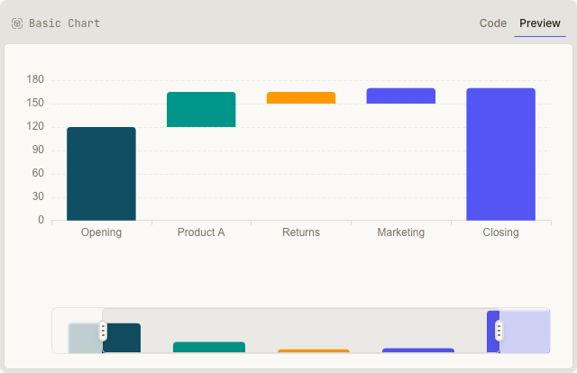

# NQChart

**Composable React charts for dashboards and BI** — Apache ECharts engine, published as `@nqlib/nqchart`, compound `NQ*Chart` API.

<p align="center">
  <picture>
    <source media="(prefers-color-scheme: dark)" srcset="docs/assets/readme/hero-dashboard-dark.png">
    
  </picture>
</p>

<p align="center">
  <a href="https://github.com/nqlib/nqchart"><strong>Repository</strong></a> ·
  <a href="https://github.com/nqlib/nqchart/tree/Released/docs">Docs (in repo)</a> ·
  <a href="https://github.com/nqlib/nqchart/blob/Released/src/content/docs/installation.mdx">Installation</a>
</p>

<p align="center">
  <a href="https://github.com/nqlib/nqchart/stargazers"></a>
  <a href="https://github.com/nqlib/nqchart/blob/Released/LICENSE"></a>
</p>

---

## Why NQChart

- **Compound components** — compose `<Bar />`, `<Grid />`, `<Legend />` as children, not a giant options object
- **Theme-aware** — `ChartConfig` maps to CSS variables for light/dark
- **One npm install** — `@nqlib/nqchart` with per-chart subpath imports; ECharts/React/motion stay peer deps
- **BI recipes** — histogram, Pareto, bullet, heatmap, gauge helpers via `@nqlib/nqchart/recipes`

Inspired by the [evilcharts](https://github.com/ali-tas/evilcharts) UX, rebuilt on **ECharts** instead of Recharts.

## Chart gallery

<p align="center">
  
</p>

<table align="center">
  <tr>
    <td align="center"><br><sub>Stacked bar</sub></td>
    <td align="center"><br><sub>Area + brush</sub></td>
  </tr>
  <tr>
    <td align="center"><br><sub>Radial / gauge</sub></td>
    <td align="center"><br><sub>Funnel</sub></td>
  </tr>
  <tr>
    <td align="center" colspan="2"><br><sub>Waterfall</sub></td>
  </tr>
</table>

## Quick install

Install the package and its peers:

```bash
npm i @nqlib/nqchart          # + peers:
npm i react react-dom echarts motion
```

Import a chart family — the root plus its scoped children come from one subpath:

```tsx
import { NQBarChart, Bar, Grid, XAxis, YAxis, Tooltip, Legend } from "@nqlib/nqchart/bar-chart";
import { type ChartConfig } from "@nqlib/nqchart";

const config = {
  desktop: { label: "Desktop", color: "var(--chart-1)" },
} satisfies ChartConfig;

export function Revenue({ data }: { data: { month: string; desktop: number }[] }) {
  return (
    <NQBarChart config={config} data={data} xDataKey="month" className="h-64 w-full p-4">
      <Grid />
      <XAxis dataKey="month" />
      <YAxis />
      <Tooltip />
      <Legend />
      <Bar dataKey="desktop" />
    </NQBarChart>
  );
}
```

BI data helpers: `import { binForHistogram, prepareParetoData } from "@nqlib/nqchart/recipes"`.

> **Prefer to own the source?** The same components are also available via the shadcn registry
> (`@nqchart` namespace at `https://nqchart.vercel.app/r/{name}.json`) — see the
> [installation docs](src/content/docs/installation.mdx).

Optional agent skill for Cursor / Claude Code:

```bash
npx skills add nqlib/nqchart --skill nqchart -y
```

## Primitives

Bar · line · area · composed · pie · radial · radar · scatter · funnel · waterfall · treemap · heatmap · calendar · sparkline

## Development

```bash
corepack enable
pnpm install
pnpm dev                 # http://localhost:3000
pnpm run registry:fresh
pnpm sync:skills
pnpm exec tsc --noEmit
pnpm test
pnpm build
```

### Refresh README screenshots

After UI changes, regenerate marketing assets (builds + starts the app automatically):

```bash
pnpm build
pnpm capture:readme
```

Or capture from a deployed URL:

```bash
BASE_URL=https://your-deploy.example.com pnpm capture:readme
```

Upload `docs/assets/readme/social-preview.png` to **GitHub → Settings → General → Social preview** for link cards.

---

Contributors: [AGENTS.md](./AGENTS.md) · [docs/index.md](./docs/index.md) · [skills/README.md](./skills/README.md)
